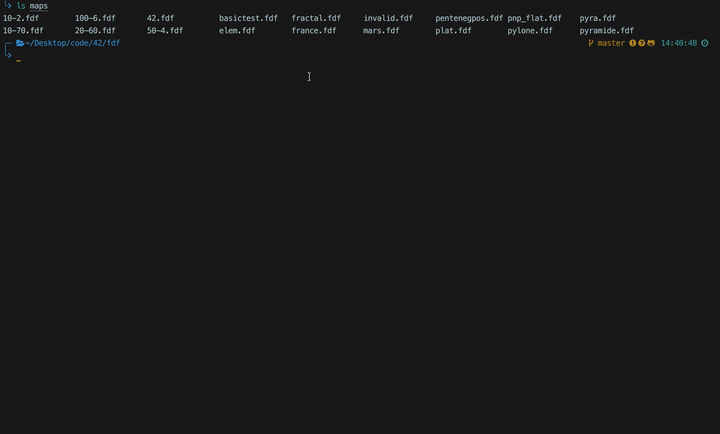
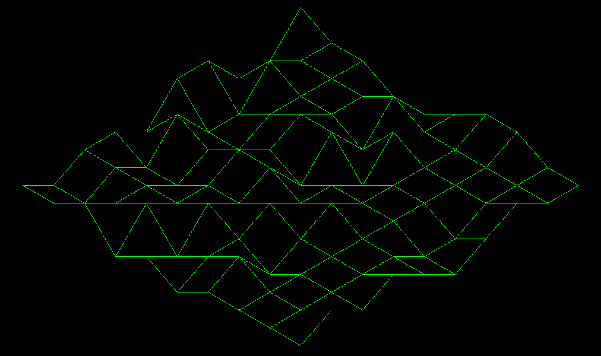

# WireFrame



This program takes a map of `int` as input and renders an isometric projection of it.
Each `int` being the `z` value of `x,y,z` vector.  

For example :  

```
1 0 0 -1 -1 0 1 1 0 0
-1 0 0 0 1 0 0 0 0 0
-1 1 0 0 -1 1 0 0 0 1
1 -1 0 1 1 -1 0 0 -1 0
1 -1 -1 0 -1 0 0 0 -1 -1
-1 1 0 1 1 0 1 0 0 0
0 -1 -1 0 0 1 0 0 0 1
0 0 0 0 1 0 -1 0 0 0
-1 -1 0 1 -1 0 1 0 0 1
0 0 1 -1 0 -1 0 0 0 0
```

Would output this :  


